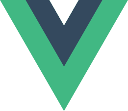
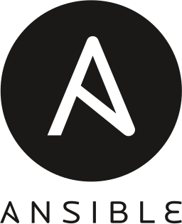

<h1>:construction: Work in Progress</h1>
 This may take a while. I am exceptionally lazy.
<h1>
    
    Hello There! 
    
</h1>

<h2>Allow me to introduce myself!</h2>

    Hei my name is Flo.  
    I am a professional developer living in Germany. 

    A very great part of my workday and spare time revolves around computers. Be it development, operational stuff or simply playing some games. 

   I initially started as a Monitoring and Backup Administrator with Zabbix and Veeam. As I was coding a lot in my spare time I switched over to become a Frontend Developer and finally a Fullstack Developer. Most of my projects are webapps for bussiness process automation. But I also code alot of helpful admin tools or plugins for applications used in our company.

<h1>Skills</h1>
<h2> Languages</h2>

    
    
    
    
    
    

<h2>Frameworks</h2>

    
    
    
    

<h2> Operational </h2>

    
    
    
    
    

There are many more skills which I have collected over the years, but the ones listed are those I use in my daily routine.